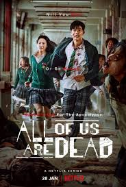

# NetFlix_Clone
## Date:
## Objective:
To create a modern, responsive navigation bar using CSS Flexbox, mimicking real-world websites like Netflix. This helps reinforce alignment, spacing, and layout structuring using Flexbox properties.

## Tasks:

#### 1. Structure the HTML Layout:
Use a ```<nav>``` tag as the main container.

Add a brand logo/title on the left using a ```<div> or <h1>```.

Add navigation links like Home, Menu, About, Contact, and Login using a ```<ul> with <li> and <a>```.

#### 2. Apply Flexbox for Layout:
Use display: flex on the ```<nav>``` container.

Use justify-content: space-between to align the logo and menu.

Use align-items: center to vertically center both sections.

Style list items with horizontal spacing using gap or margin.

#### 3. Style Like a Real-World Navbar:
Add background color (e.g., dark or gradient like Netflix/Zomato).

Style text with bold fonts, hover effects, and link styling.

Remove default ul and li styles (list-style: none, text-decoration: none).

#### 4. Bonus Enhancements:
Add a hover underline or button effect on links.

Make it responsive using flex-wrap or media queries.

Fix the nav bar to top with position: sticky.
## HTML Code:
```
<!DOCTYPE html>
<html lang="en">
<head>
  <meta charset="UTF-8" />
  <meta name="viewport" content="width=device-width, initial-scale=1.0"/>
  <title>Netflix Clone</title>
  <link rel="stylesheet" href="style.css"/>
</head>
<body>

  <!-- Navbar -->
  <nav class="navbar">
    <div class="logo">NETFLIX</div>
    <ul class="nav-links">
      <li><a href="#">Home</a></li>
      <li><a href="#">Movies</a></li>
      <li><a href="#">TV Shows</a></li>
      <li><a href="#">My List</a></li>
    </ul>
    <div class="nav-icons">
      <input type="text" placeholder="Search" class="search-box" />
      
    </div>
  </nav>

  <!-- Featured Movie -->
  <section class="featured">
    <div class="featured-content">
      <h1>All of Us Are Dead</h1>
      <p>A zombie virus breaks out fast in a high school. Students must survive — or turn.</p>
      <div class="featured-buttons">
        <button class="play-btn">▶ Play</button>
        <button class="info-btn">More Info</button>
      </div>
    </div>
  </section>

  <!-- Movie List -->
  <section class="movie-list">
    <h2>Popular on Netflix</h2>
    <div class="movies">
      <div class="movie">
        
        <p>Squid Game</p>
      </div>
      <div class="movie">
        
        <p>Hidden Love</p>
      </div>
      <div class="movie">
        
        <p>All of Us Are Dead</p>
      </div>
      <div class="movie">
        
        <p>Money Heist</p>
      </div>
      <div class="movie">
        
        <p>Business Proposal</p>
      </div>
    </div>
  </section>

</body>
</html>

```
## CSS Code:
```
* {
  margin: 0;
  padding: 0;
  box-sizing: border-box;
}

body {
  background-color: #141414;
  color: white;
  font-family: Arial, sans-serif;
}

.navbar {
  background-color: #000;
  display: flex;
  justify-content: space-between;
  align-items: center;
  padding: 16px 32px;
  position: sticky;
  top: 0;
  z-index: 1000;
}

.logo {
  font-size: 28px;
  font-weight: bold;
  color: red;
}

.nav-links {
  list-style: none;
  display: flex;
  gap: 24px;
}

.nav-links li a {
  color: white;
  text-decoration: none;
  font-weight: 500;
  transition: border-bottom 0.3s ease;
}

.nav-links li a:hover {
  border-bottom: 2px solid red;
}

.nav-icons {
  display: flex;
  align-items: center;
  gap: 16px;
}

.search-box {
  padding: 6px 10px;
  border-radius: 4px;
  border: none;
  outline: none;
  background-color: #333;
  color: white;
}

.user-icon {
  border-radius: 50%;
  width: 30px;
  height: 30px;
}

/* Featured Section */
.featured {
  background: url('sg.jpg') no-repeat center center/cover;
  height: 70vh;
  display: flex;
  align-items: center;
  padding-left: 50px;
  position: relative;
}

.featured::after {
  content: '';
  position: absolute;
  top: 0;
  right: 0; 
  bottom: 0; 
  left: 0;
  background: rgba(0, 0, 0, 0.5);
}

.featured-content {
  position: relative;
  z-index: 1;
  max-width: 600px;
}

.featured-content h1 {
  font-size: 40px;
  margin-bottom: 10px;
}

.featured-content p {
  font-size: 18px;
  margin-bottom: 20px;
}

.featured-buttons button {
  padding: 10px 20px;
  margin-right: 10px;
  font-size: 16px;
  cursor: pointer;
  border: none;
  border-radius: 5px;
}

.play-btn {
  background-color: #fff;
  color: #000;
}

.info-btn {
  background-color: rgba(109, 109, 110, 0.7);
  color: white;
}

/* Movie List */
.movie-list {
  padding: 30px 50px;
}

.movie-list h2 {
  font-size: 24px;
  margin-bottom: 20px;
}

.movies {
  display: flex;
  gap: 16px;
  flex-wrap: wrap;
}

.movie {
  width: 180px;
  text-align: center;
}

.movie img {
  width: 100%;
  border-radius: 6px;
  transition: transform 0.3s;
}

.movie img:hover {
  transform: scale(1.05);
}

.movie p {
  margin-top: 8px;
  font-size: 14px;
}

/* Responsive */
@media (max-width: 768px) {
  .nav-links {
    display: none;
  }

  .featured-content h1 {
    font-size: 28px;
  }

  .movie {
    width: 45%;
  }
}

```
## Output:


## Result:
A modern, responsive navigation bar using CSS Flexbox, mimicking real-world websites like Netflix. This helps reinforce alignment, spacing, and layout structuring using Flexbox properties is created successfully.
